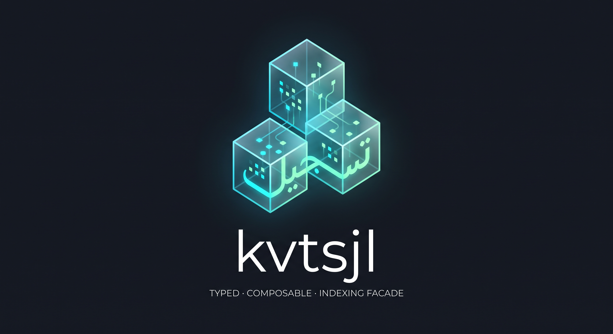
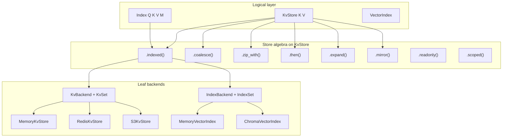
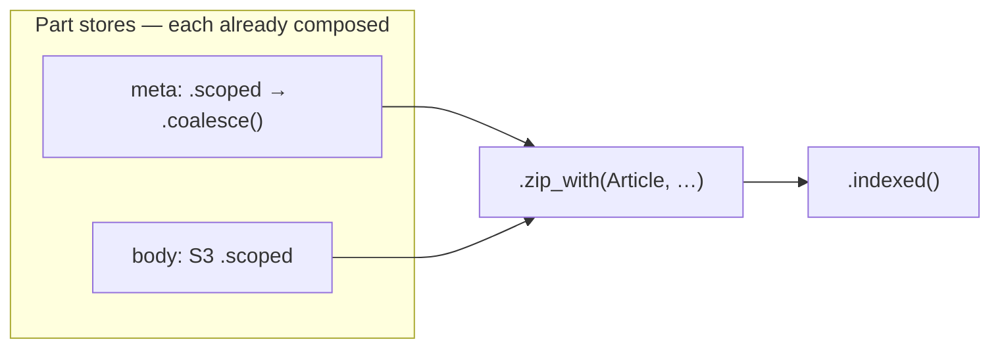

<p align="center">
  
</p>

**kvtsjl** (*kv-tasjil*, from Arabic *tasjīl* تسجيل — “recording”) is a **typed, composable Python library for key–value storage with first-class indexing**.

Define your domain keys and values once. Plug in Redis, S3, GCS, filesystem, or in-memory backends without rewriting business logic. Attach exact, term, or vector indexes that stay in sync on every write—then search and hydrate documents from a single API.

Python **3.12+** · **pyright strict** · **zero required dependencies** · Apache 2.0

---

## Why kvtsjl?

Most KV libraries force you to choose early: either a thin dict wrapper around a driver, or a heavy ORM. kvtsjl sits in between:

| Problem | kvtsjl approach |
|--------|------------------|
| Backend lock-in | **Logical** `KvStore` / **physical** `KvBackend` split—swap leaves, keep callers |
| Ad-hoc search | **Indexes** attach to a store; writes sync automatically |
| Leaky key encoding | **`KvSet`** + **`SerDe`** wire domain types to bytes; **`Scope`** partitions namespaces |
| Cache / tiering hacks | **`KvStore` algebra** — `.coalesce()`, `.mirror()`, `.zip_with()`, `.then()`, `.expand()` |
| Untyped I/O | Generics end-to-end; strict static checking in CI |

---

## Use cases

- **Session & config cache** — hot path on Redis, cold fallback to S3 or filesystem; promote hits with `.coalesce()` / `.fallback_read()`.
- **RAG / semantic search** — documents in object storage or Redis; vector index synced on write; search hydrates values from the same store.
- **Multi-tenant SaaS** — one `KvSet` schema; isolate tenants with `.scoped(tenant_id=…)` without separate client instances.
- **Migration & dual-read** — new primary store with read-through to a legacy backend until cutover completes.
- **Audit & replication** — `.mirror()` write-through to a secondary bucket or region while reads stay on primary.
- **Read-only workers** — indexers, exporters, and APIs wrap the store with `.readonly()` to block accidental writes.
- **Bring your own storage** — implement `KvBackend` or `IndexBackend` for DynamoDB, Postgres, an internal blob service, etc.; reuse composition and indexing unchanged.
- **Split documents** — `.zip_with(Article, meta=…, body=…)` joins part stores; each part keeps its own `.coalesce()` / `.scoped()` chain (see [Store algebra](#store-algebra)).

---

## Features

- **Typed CRUD** — `get` / `set` / `delete` + batch variants, `scan`, `get_or_set`
- **Wire schema** — `KvSet` describes key/value serdes, layout, TTL; leaf backends own I/O
- **Scope views** — prefix namespaces without copying data
- **Multi-index search** — attach several indexes; `store.search(index, query)` returns keys or hydrated values
- **Vector indexes** — `MemoryVectorIndex` (exact L2) or optional **`ChromaVectorIndex`**
- **Store algebra** — `.map` / `.imap` / `.imap_keys`, `.zip` / `.zip_with` / `.zip_as`, `.then` / `.then_with`, `.expand` / `.expand_map`, `.coalesce`, plus `.mirror()`, `.indexed()`, `.readonly()`, `.scoped()`
- **Extensible adapters** — subclass `KvBackend` / `IndexBackend`; plug in custom serdes and binders
- **Optional integrations** — Pydantic serdes, Redis, S3/MinIO, GCS, ChromaDB

---

## Architecture

Logical APIs stay backend-agnostic. Physical backends carry wire identity and medium-specific I/O. Indexes mirror the same split.



---

## Quick start

```python
from kvtsjl import KvSet, MemoryKvStore, SerDe

kvset = KvSet.with_str_keys(
    "users",
    key_serde=SerDe.identity(str),
    value_serde=SerDe.utf8_bytes(),
)
store = MemoryKvStore(kvset)

store.set("alice", "admin")
store.set("bob", "member")

assert store.get("alice") == "admin"
for key in store.scan(prefix="a"):
    print(key)  # alice
```

---

## Indexed search

Attach indexes with `.indexed(...)`. Mutations on the store sync every attached index.

```python
from kvtsjl import KvSet, MemoryKeyIndex, MemoryKvStore, MemoryTermIndex, SerDe

kvset = KvSet.with_str_keys("docs", key_serde=SerDe.identity(str), value_serde=SerDe.utf8_bytes())
terms = MemoryTermIndex(terms_of=lambda k, v: v.split())
store = MemoryKvStore(kvset).indexed(
    MemoryKeyIndex(),  # exact key lookup
    terms,             # term → keys
)

store.set("doc:1", "hello world")
store.set("doc:2", "hello again")

assert store.search(terms, "hello")  # hydrated values
hits = store.search_hits(terms, "world")
```

---

## Vector search

Vector indexes carry wired metadata (`VectorRecord`) plus optional document, embedding, and search-time **score**.

```python
from kvtsjl import IndexSet, KvSet, MemoryKvStore, MemoryVectorIndex, SerDe, VectorQuery

def embedding_of(_key: str, value: str) -> list[float]:
    return [float(len(value)), float(value.count(" "))]

kvset = KvSet.with_str_keys("docs", key_serde=SerDe.identity(str), value_serde=SerDe.utf8_bytes())
index_set = IndexSet.with_str_ids(
    "docs",
    id_serde=SerDe.identity(str),
    meta_serde=SerDe.identity(dict),
    embedding_of=embedding_of,
    document_of=lambda _k, v: v,
)
vec = MemoryVectorIndex(
    index_set=index_set,
    merge_data_fn=lambda _k, _v, prev: {"score": 0.0} if prev is None else prev,
    embed_content=lambda text: embedding_of("", text),
)

store = MemoryKvStore(kvset).indexed(vec)
store.set("a", "short")
store.set("b", "much longer text")

# By embedding or by embeddable content (text, bytes, …)
results = store.search(vec, VectorQuery(content="longer"))
hits = store.search_hits(vec, VectorQuery(embedding=[16.0, 1.0]))
```

**ChromaDB** (optional extra): pass your own `Collection`; kvtsjl handles upsert, metadata round-trip, and `ChromaQuery` filters.

```python
import chromadb
from kvtsjl.backends.index.chroma import ChromaQuery, ChromaVectorIndex

collection = chromadb.EphemeralClient().get_or_create_collection("my-docs")
chroma = ChromaVectorIndex(index_set=index_set, collection=collection, merge_data_fn=...)
store = MemoryKvStore(kvset).indexed(chroma)
hits = store.search_hits(chroma, ChromaQuery(embedding=[1.0, 0.0], where={"tag": "news"}))
```

---

## Extensibility

kvtsjl ships adapters for memory, filesystem, Redis, S3, GCS, and Chroma—but the design is **adapter-first**, not monolithic.

| Layer | Extend by | You provide |
|-------|-----------|-------------|
| **Document storage** | Subclass `KvBackend` | A `KvSet` (key/value serdes, layout) + medium I/O |
| **Search index** | Subclass `IndexBackend` or `VectorIndexBackend` | An `IndexSet` + `search` / `upsert` / `sync` |
| **Wire format** | Custom `SerDe` | Serialize domain `K` / `V` / metadata to blobs |
| **Key layout** | `NamespaceBinder` + `Scope` | How logical keys map to collections and prefixes |

Logical code depends on **`KvStore`** and **`Index`**—not on Redis or S3 types. Swap or add a leaf backend, keep composition, indexes, and call sites.

```python
from kvtsjl import KvBackend, KvSet, IndexBackend, IndexSet, SerDe

class MyKvBackend(KvBackend[str, MyDoc, str, bytes, str]):
    """Adapter for your existing storage SDK."""
    ...

class MyIndexBackend(IndexBackend[MyQuery, str, MyDoc, MyMeta, ...]):
    """Adapter for your search engine."""
    ...
```

---

## Composition

Build behavior by **chaining methods on `KvStore`**—no subclassing, no wrapper boilerplate. Each method returns a new logical store.

| Method | Effect |
|--------|--------|
| `.indexed(index, …)` | Attach indexes; writes sync to all; enables `search` / `search_hits` |
| `.coalesce(other)` / `.fallback_read(other)` | Left-biased merge; optional promote on secondary hit |
| `.mirror(secondary)` | Write-through to secondary; reads stay on primary |
| `.readonly()` | Reject mutations |
| `.scoped(tenant_id=…)` | Narrow to a logical key prefix / namespace |

```python
from kvtsjl.backends.redis import RedisKvStore
from kvtsjl.backends.s3 import S3KvStore

redis_store = RedisKvStore(...)       # hot tier
s3_archive = S3KvStore(...)           # cold fallback
s3_audit = S3KvStore(...)             # write-through replica

# Chain: scope → tiered reads → audit mirror → vector search
store = (
    redis_store
    .scoped(tenant_id="acme")
    .coalesce(s3_archive, promote=True)
    .mirror(s3_audit)
    .indexed(vector_index, term_index)
)

store.set("doc:1", document)          # writes Redis + S3 audit + syncs indexes
hits = store.search_hits(vector_index, VectorQuery(content="quarterly report"))
readonly_view = store.readonly()      # same data, no mutations
```

Underlying wrapper types (`IndexedKvStore`, `FallbackReadKvStore`, …) exist for typing and introspection, but **callers should prefer the composition API** above.

---

## Store algebra

`KeyMap[K, T]` (and every `KvStore`) is an **abstract data type** over keys and values. Algebra acts on values, keys, and across maps—without inventing niche names like “federate.”

| Axis | Operator | Role |
|------|----------|------|
| Values | `.map` / `.imap` | View / invertible codec |
| Values | `.zip` / `.zip_with` / `.zip_as` | Pointwise product; parts are `T \| None` |
| Values | `.expand` / `.expand_map` | Value → nested collection; **same outer `K`**; caller folds |
| Keys | `.imap_keys` | Caller ↔ storage key (e.g. hash) |
| Keys | `.scoped` | Restrict keyspace |
| Across | `.then` / `.then_with` | `other[self[k]]` / `other[f(k,v)]` (FK-style) |
| Merge | `.coalesce` | Left-biased (same as `.fallback_read`) |
| Policy | `.mirror`, `.indexed`, `.readonly` | Operational |

### Optional zip

A row exists if **any** part is present; each field is independently `PartV | None`. `set` writes non-`None` parts and clears `None` ones. `scan` is the union of part keys.

```python
from dataclasses import dataclass

from kvtsjl import KeyMap

@dataclass
class Article:
    meta: dict | None
    body: str | None

articles = KeyMap.zip_with(Article, meta=meta_store, body=body_store)
# or: KvStore.zip_with(...) — same API on stores

articles.set("doc:1", Article(meta={"tag": "news"}, body="…"))
articles.set("doc:1", Article(meta=None, body="updated"))  # clears meta, keeps body
```

**Strict typing** — prefer `.zip_as` with a parts bundle (like `.indexed_as` for indexes):

```python
@dataclass
class ArticleParts:
    meta: KvStore[str, dict]
    body: KvStore[str, str]

articles = KvStore.zip_as(Article, ArticleParts(meta=meta_store, body=body_store))
# KvStore[str, Article] with per-part value types on the bundle
```

Or keep `.zip_with` and annotate a `TypedDict` at the call site:

```python
from typing import TypedDict

class ArticlePartsTD(TypedDict):
    meta: KvStore[str, dict]
    body: KvStore[str, str]

parts: ArticlePartsTD = {"meta": meta_store, "body": body_store}
articles = KvStore.zip_with(Article, **parts)
```

Compose each part first, then zip:

```python
articles = (
    KvStore.zip_with(
        Article,
        meta=redis.scoped(part="meta").coalesce(s3_legacy.scoped(part="meta"), promote=True),
        body=s3.scoped(tenant_id="acme", part="body"),
    )
    .indexed(vector_index, term_index)
)
```



### `then` / `then_with`

Foreign-key style lookup. Read-focused in v1 (`set` unsupported).

```python
order_users = orders.then(users)  # OrderId → User
docs_authors = docs.then_with(lambda k, d: d.author_id, authors)  # DocId → Author
```

### `expand` / `expand_map`

Keep outer keys; put multi-results **inside** the value as a nested collection. No global keyspace explosion—caller folds with `.map` or `.expand_map`.

```python
# UserId → KeyMap[Email, bool] (or another Col shape)
per_user_emails = users.expand(lambda user_id, user: email_index.children_of(user_id))

# Fold nested Col → aggregated value
address_book = per_user_emails.map(lambda col: sorted(col.keys()))

summaries = users.expand_map(
    lambda k, u: email_index.children_of(k),
    lambda k, u, col: UserSummary(u, emails=list(col.keys())),
)
```

### `imap_keys`

Map caller keys to storage keys (e.g. SHA-256). One-way maps cannot `scan` without an inverse.

```python
hashed = memory.imap_keys(sha256_hex, from_store)  # from_store optional
```

### Typical pipeline

```text
imap_keys → imap → coalesce → zip_with → then → expand → map → indexed
```

Light laws: zip row iff any part; `then` is `other.get(self.get(k))`; expand miss iff left miss; coalesce is left-or-right with writes on left.

---

## Backends & indexes

| Component | In core | Optional extra |
|-----------|---------|----------------|
| `MemoryKvStore` | ✓ | |
| `FilesystemKvStore` | ✓ | |
| `RedisKvStore` | | `redis` |
| `S3KvStore` | | `s3` |
| `GcsKvStore` | | `gcs` |
| `MemoryKeyIndex` / `MemoryTermIndex` | ✓ | |
| `MemoryVectorIndex` | ✓ | |
| `ChromaVectorIndex` | | `chroma` |
| Pydantic `SerDe` helpers | | `pydantic` |

Don't see your system? Implement **`KvBackend`** / **`IndexBackend`** (see [Extensibility](#extensibility)) and use the same composition API.

---

## Install

```bash
pip install kvtsjl

# Optional integrations
pip install 'kvtsjl[pydantic]'   # kvtsjl.serde.pydantic
pip install 'kvtsjl[redis]'      # RedisKvStore
pip install 'kvtsjl[s3]'         # S3KvStore (AWS S3 / MinIO)
pip install 'kvtsjl[gcs]'        # GcsKvStore
pip install 'kvtsjl[chroma]'     # ChromaVectorIndex
pip install 'kvtsjl[all]'        # every optional integration
pip install 'kvtsjl[dev]'        # tests, ruff, pyright + all extras
```

| Extra | Import |
|-------|--------|
| `pydantic` | `from kvtsjl.serde.pydantic import for_pydantic, …` |
| `redis` | `from kvtsjl.backends.redis import RedisKvStore` |
| `s3` | `from kvtsjl.backends.s3 import S3KvStore` |
| `gcs` | `from kvtsjl.backends.gcs import GcsKvStore` |
| `chroma` | `from kvtsjl.backends.index.chroma import ChromaVectorIndex, ChromaQuery` |

---

## Development

```bash
python -m venv .venv
source .venv/bin/activate
pip install -e ".[dev]"

pytest
pytest --cov=kvtsjl --cov-report=term-missing
pyright
ruff check src tests          # import sorting enforced (rule I)
ruff check --fix src tests    # auto-fix imports
```

Integration tests use in-process fakes—no Docker required: `s3` → **moto**, `redis` → **fakeredis**, `gcs` → in-memory bucket, `chroma` → **EphemeralClient**.

---

## License

Apache License 2.0 — see [LICENSE](LICENSE).
